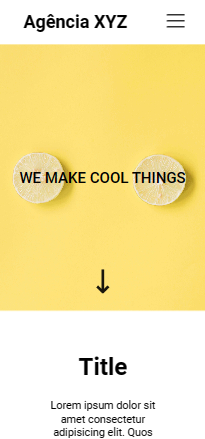

<h1 align="center"> Leanding Page com Flex e Grid </h1>

Projeto Leanding Page com Flex e Grid! 

  <a href="#-tecnologias">Tecnologias</a>&nbsp;&nbsp;&nbsp;|&nbsp;&nbsp;&nbsp;
  <a href="#-projeto">Projeto</a>&nbsp;&nbsp;&nbsp;&nbsp;&nbsp;&nbsp;
  

 
  
Desktop Version

  

  
  

  
Mobile Version

  

  
  

## 🚀 Tecnologias

Esse projeto foi desenvolvido com as seguintes tecnologias:

- HTML
- CSS
- Git e Github

## 💻 Projeto

Esse projeto de uma Leanding Page com Flex e Grid!

- [Acesse o projeto finalizado, online](https://github.com/CarlosHerbertDev/leanding-page-flexegrid/)